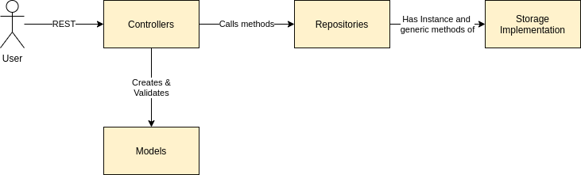

# go-app
Repository for a Go-app 

The following project intends to be a learning example of a marketplace for boardgame related products. 

 
< Better describe the Architecture >


# Useful links/tools
## Structure 
[Project Structure using Repository Pattern](https://dakaii.medium.com/repository-pattern-in-golang-d22d3fa76d91)

The structured used in the services was based on the previous link, and intends to asbtract the different layers while allowing to "pass around" the database instance. 



In the Controllers, which contain the REST endpoints that user interacts with, we do all functional logic which includes creating Models, invoking their validation, and redirecting the storage interactions to the Repositories. It stands to reason that in the controllers, we have Repository interfaces that abstract the implementation of these methods while allowing it to be swapped out, enforcing loose coupling.

In the Repositories, we have an abstracted storage instance and this layer is the abstraction bridge between the controllers and the storage implementation. This was interesting since if we wanted to change the storage implementation, we could maintain the Repository as long as the generic methods maintained the same (Loosely coupled).

The storage implementation, in this case, is a specific PostgreSQL implementation of generic but database specific methods that allow us to create, read, update and delete objects. It stands to reason that in this project we used a ORM, namely Gorm, to interact with the database.

In the main file, we sequentially:
1. Connect to the Database
2. Initialize the Repositories with the database
3. Initialize the Controllers with the repositories
4. Add the Routers with the controllers

Note: Optionally we could always further abstract the controllers into Controllers & Services, however there was no need to further complicate the structure given the size of the project.


## Documentation
For the documentation of the application, [Swag](https://github.com/swaggo/swag#the-swag-formatter) was used.
For a tutorial, see -> [Tutorial](https://martinheinz.dev/blog/9)

## Testing
[Framework](https://apitest.dev/)

Command to test   
Godotenv -> Initializes with .env   
./... -> Tests all directories   
DATABASE_HOST -> Overwrites host since tests are not running in docker
```
DATABASE_HOST=localhost godotenv -f .env go test ./... -v
```

For learning the testing framework, I developed Functional tests that simulate user behaviour on the catalog to trigger success and failure scenarios. 

< Better describe the Tests implemented >

< Implement and describe the Unit tests on the utils >


## Sorting
[Sorting in Golang](https://yourbasic.org/golang/how-to-sort-in-go/)

## Validation
[govalidator](https://github.com/asaskevich/govalidator)

## Possible CLI 
[Cobra](https://github.com/spf13/cobra)

## JSON 
[Decoding JSON Body](https://www.alexedwards.net/blog/how-to-properly-parse-a-json-request-body)


# Support Suff

## Blogs, workshops, etc
​
## [Francesc Campoy Flores](https://www.campoy.cat) 
​
* Workshop @CERN "An Introduction to Go": [Pt 1](https://www.youtube.com/watch?v=xi8732QO33Y&t=2475s), [Pt 2](https://www.youtube.com/watch?v=wCU4g0kVZ8Y&t=647s), [Pt 3](https://www.youtube.com/watch?v=axXuYFA80QM&t=4s)
* [Youtube channel](https://www.youtube.com/channel/UC_BzFbxG2za3bp5NRRRXJSw/)
​
## [Dave Cheney](https://dave.cheney.net/about)
​
* [Blog](https://dave.cheney.net/)
* [Practical Go: Real world advice for writing maintainable Go programs](https://dave.cheney.net/practical-go/presentations/qcon-china.html)
​
## [Rob Pike](https://research.google/people/r/)
​
* [Presentation "Concurrency Is Not Parallelism"](https://www.youtube.com/watch?v=cN_DpYBzKso)
​
### [Russ Cox](https://swtch.com/~rsc/)
​
* [A Tour of Go](https://www.youtube.com/watch?v=ytEkHepK08c)
​
### [Jaana Dogan](https://rakyll.org/about/)
​
* [Blog](https://rakyll.org/)
​
## Ebooks & tutorials
​
* https://go101.org/
* http://www.golangbootcamp.com/book/frontmatter
* https://golangbot.com/learn-golang-series/
* https://go.dev/blog/slices-intro