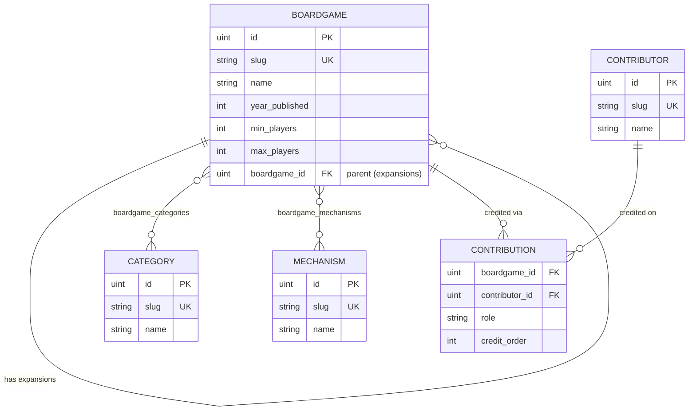

# Catalog

The **catalog** service is the system of record for boardgame reference data. It stores the games themselves along with the metadata used to describe and classify them, and exposes a read/write HTTP API so that other services (e.g. the marketplace) and admin tooling can browse and manage that data.

### Purpose

Provide a single, authoritative source for "what a boardgame is" — its attributes, how it is classified, who made it, and how expansions relate to base games — independent of pricing, inventory, or user activity.

### Scope

- **In scope:** boardgames and expansions, their descriptive attributes, classification (categories, mechanisms), industry credits (contributors), and CRUD + list/sort/filter over all of the above.
- **Out of scope:** pricing, stock, orders, user accounts, and reviews. Those belong to other services. The catalog only exposes a lightweight `rate` hook that is forwarded elsewhere.

### Design notes

- Data is **admin-managed**; there is no public write path. Future work may add BoardGameGeek import.
- Persistence is **PostgreSQL** via `pgx`. The schema is defined in `internal/database/migrations` and is the source of truth for column types and constraints.

## Domain model

The catalog has one central entity, **Boardgame**, that everything else hangs off of.

- A **Boardgame** may be a base game or an **expansion**. An expansion points at exactly one parent boardgame; a base game can have many expansions. This is a self-relationship (`boardgame_id`), and it is one level deep — an expansion cannot itself have expansions.
- **Categories** and **Mechanisms** are independent taxonomies. Each is a simple named entity that can be attached to many boardgames, and a boardgame can have many of each (many-to-many).
- **Contributors** are people or companies (designers, artists, publishers, …). A contributor is attached to a boardgame through a **Contribution**, which is the many-to-many link *plus* two extra attributes: the `role` played and an optional `credit_order`. The same contributor can appear on a game in more than one role.

### Relationships



| Relationship              | Cardinality                   | Backed by                                          |
| ------------------------- | ----------------------------- | -------------------------------------------------- |
| Boardgame -> expansions   | one-to-many (self, one level) | `boardgames.boardgame_id`                          |
| Boardgame <-> Category    | many-to-many                  | `boardgame_categories`                             |
| Boardgame <-> Mechanism   | many-to-many                  | `boardgame_mechanisms`                             |
| Boardgame <-> Contributor | many-to-many with attributes  | `boardgame_contributions` (`role`, `credit_order`) |

## Conventions

These apply consistently across all endpoints unless noted otherwise.

### Addressing & identifiers

- **Base path:** everything is served under `/api`.
- **Slug is the public key.** Every boardgame, category, mechanism, and contributor is addressed by a URL-safe `slug`. The numeric `id` is internal.
- **Slugs are derived, not supplied.** The slug is generated from `name` on creation and is **immutable** thereafter; it is never read from the request body. To change a game's canonical name, create a new record.

### Fields & nullability

- **Required on create:** boardgame needs `name`, `min_players`, `max_players`; taxonomies and contributors need `name`.
- **Empty vs. set (non-nullable):** `description`, `year_published`, `min_play_time`, `max_play_time` are non-nullable. Omit them (or send `""` / `0`) to mean "unset"; there is no separate "null" state.
- **Truly optional (nullable):** `min_age`, `bgg_id`, and the expansion parent (`boardgame_id`) may be absent.
- **Partial updates:** `PATCH` only touches fields present in the body; omitted fields are left unchanged.

### Associations

- **Reference-only.** When you attach `categories`, `mechanisms`, or `contributions` to a boardgame, each referenced slug **must already exist** (created via its own endpoint). The catalog does not create associated records on the fly; unknown references fail the request.

### Deletion

- **Soft by default.** `DELETE` sets `deleted_at` and hides the record from reads. Add `?hard=true` to remove it permanently.
- **Cascade.** Deleting a base boardgame also deletes its expansions (soft or hard, matching the request).

### Errors

- `400 Bad Request` — invalid body, or a `name` that produces an empty slug (e.g. `"!!!"`).
- `404 Not Found` — unknown slug/id, or a referenced association that does not exist.
- `409 Conflict` — slug already in use (disambiguate the name, e.g. add a year/edition), or attempting to give an expansion its own expansion.
- `422 Unprocessable Entity` — malformed or invalid `sort`/`filter`/`page`/`pageSize`, whether sent as GET query parameters or in a `QUERY` request body.

## Swagger

Interactive API docs are generated with [`swag`](https://github.com/swaggo/swag) and served at:

```
GET /swagger/index.html
```

Regenerate after changing handler annotations:

```bash
make swag svc=catalog
```

Note: the `QUERY` list endpoints are not shown in Swagger because OpenAPI 2.0
does not support the `QUERY` HTTP method. The `GET` list endpoints are documented
there in full and return the same envelope. See
[Listing, filtering, sorting & pagination](#listing-filtering-sorting--pagination).

## Boardgame API

Create request body:

```json
{
  "name": "Catan",
  "description": "A trading and building game.",
  "year_published": 1995,
  "min_players": 3,
  "max_players": 4,
  "min_play_time": 45,
  "max_play_time": 90,
  "min_age": 10,
  "bgg_id": 13,
  "categories": [{ "slug": "economic" }],
  "mechanisms": [{ "slug": "trading" }],
  "contributions": [
    { "slug": "klaus-teuber", "role": "designer", "credit_order": 1 }
  ]
}
```

Only `name`, `min_players`, and `max_players` are required.

### Endpoints

| Method | Path                              | Description                                     |
| ------ | --------------------------------- | ----------------------------------------------- |
| POST   | `/api/boardgame`                  | Create a boardgame                              |
| POST   | `/api/boardgame/{slug}/expansion` | Create an expansion of `{slug}`                 |
| GET    | `/api/boardgame`                  | List with filter/sort/pagination (envelope)     |
| QUERY  | `/api/boardgame`                  | Same, with the request in a JSON body           |
| GET    | `/api/boardgame/{slug}`           | Fetch one by slug                               |
| GET    | `/api/boardgame/by-id/{id}`       | Fetch one by numeric id (internal)              |
| PATCH  | `/api/boardgame/{slug}`           | Partial update                                  |
| DELETE | `/api/boardgame/{slug}`           | Soft delete (`?hard=true` to hard delete)       |
| POST   | `/api/boardgame/{slug}/rate`      | Rate a boardgame                                |

### Examples

```bash
# Create
curl -X POST localhost:8081/api/boardgame \
  -H 'Content-Type: application/json' \
  -d '{"name":"Catan","min_players":3,"max_players":4,"year_published":1995}'

# Create an expansion of "catan"
curl -X POST localhost:8081/api/boardgame/catan/expansion \
  -H 'Content-Type: application/json' \
  -d '{"name":"Catan: Seafarers","min_players":3,"max_players":4}'

# Fetch by slug
curl localhost:8081/api/boardgame/catan

# Update (partial) — omitted fields are left unchanged
curl -X PATCH localhost:8081/api/boardgame/catan \
  -H 'Content-Type: application/json' \
  -d '{"max_players":6}'

# Soft delete, then hard delete
curl -X DELETE localhost:8081/api/boardgame/catan
curl -X DELETE "localhost:8081/api/boardgame/catan?hard=true"

# Include soft-deleted rows in a list
curl "localhost:8081/api/boardgame?include_deleted=true"
```

### Listing, filtering, sorting & pagination

Every list resource (boardgame, category, mechanism, contributor) can be listed
two ways, both returning the same paginated envelope:

- `GET` with query parameters — cacheable, browsable, and documented in Swagger.
  Use this by default.
- `QUERY` with a JSON body — for filter sets too large or awkward to express in a
  URL.

```json
{
  "data": [ /* items */ ],
  "page": 1,
  "pageSize": 10,
  "totalItems": 42,
  "totalPages": 5
}
```

GET query parameters (all optional):

| Parameter         | Form              | Example                 |
| ----------------- | ----------------- | ----------------------- |
| `page`            | integer           | `page=2`                |
| `pageSize`        | integer           | `pageSize=20`           |
| `sort`            | `field.order`     | `sort=name.asc`         |
| `filter`          | `field.op.value`  | `filter=minplayers.ge.3` (repeatable) |
| `include_deleted` | boolean           | `include_deleted=true` (boardgames only) |

QUERY request body (send `{}` for defaults):

```json
{
  "pagination": { "page": 1, "pageSize": 20 },
  "sort": { "field": "name", "order": "asc" },
  "filters": [
    { "field": "minplayers", "op": "ge", "value": "3" },
    { "field": "name", "op": "like", "value": "cat" }
  ],
  "include_deleted": false
}
```

- **Pagination.** `page` defaults to `1`, `pageSize` defaults to `10` and is
  clamped to a max of `100`. Out-of-range values are clamped rather than
  rejected; non-numeric ones return `422`.
- **Sorting.** `field` is a struct field name (case-insensitive) mapped to its DB
  column via the model's `db` tag; `order` is `asc` or `desc`. Fields tagged
  `db:"-"` (`categories`, `mechanisms`, `contributions`, `ratings`,
  `expansions`) are not sortable.
- **Filtering.** Each filter has `field`, `op`, and `value`. Supported `op`
  values:

  | `op`                 | Mode                 | SQL                          |
  | -------------------- | -------------------- | ---------------------------- |
  | `like` (or omitted)  | Partial string match | `WHERE name ILIKE '%value%'` |
  | `eq`                 | Exact equality       | `WHERE name = 'value'`       |
  | `lt` `le` `gt` `ge`  | Numeric comparison   | `WHERE min_players >= value` |

  Multiple filters are combined with `AND`. In the `filter` query parameter the
  operator is mandatory (`filter=name.like.cat`, not `filter=name.cat`), which is
  what lets a value contain dots: `filter=name.like.foo.bar` filters on
  `foo.bar`.

```bash
# Defaults (first page)
curl localhost:8081/api/boardgame

# Page 2, 20 per page, sorted by name, filtered
curl "localhost:8081/api/boardgame?page=2&pageSize=20&sort=name.asc&filter=minplayers.ge.3"

# The same request as QUERY
curl -X QUERY localhost:8081/api/boardgame \
  -H 'Content-Type: application/json' \
  -d '{"pagination":{"page":2,"pageSize":20},"sort":{"field":"name","order":"asc"},"filters":[{"field":"minplayers","op":"ge","value":"3"}]}'
```

A `QUERY` request must send `Content-Type: application/json` and a body (use
`{}` for defaults). Invalid sort/filter fields or operators return
`422 Unprocessable Entity` on either method.

## Category & Mechanism API

Categories and mechanisms share the same shape and behavior; only the base path differs (`/api/category`, `/api/mechanism`).

Create request body:

```json
{ "name": "Economic", "bgg_id": 1021 }
```

Only `name` is required; the slug is derived from it.

| Method | Path                   | Description                               |
| ------ | ---------------------- | ----------------------------------------- |
| POST   | `/api/category`        | Create                                    |
| GET    | `/api/category`        | List with filter/sort/pagination (envelope) |
| QUERY  | `/api/category`        | Same, with the request in a JSON body     |
| GET    | `/api/category/{slug}` | Fetch by slug                             |
| DELETE | `/api/category/{slug}` | Soft delete (`?hard=true` to hard delete) |

See [Listing, filtering, sorting & pagination](#listing-filtering-sorting--pagination) for the parameters, body, and envelope shape.

```bash
curl -X POST localhost:8081/api/category -H 'Content-Type: application/json' -d '{"name":"Economic"}'
curl "localhost:8081/api/mechanism?sort=name.asc"
curl localhost:8081/api/category/economic
curl -X DELETE "localhost:8081/api/mechanism/trading?hard=true"
```

## Contributor API

Contributors are the people/companies credited on a boardgame.

Create request body:

```json
{ "name": "Klaus Teuber", "bio": "German game designer.", "bgg_id": 11 }
```

Only `name` is required.

| Method | Path                       | Description                               |
| ------ | -------------------------- | ----------------------------------------- |
| POST   | `/api/contributors`        | Create                                    |
| GET    | `/api/contributors`        | List with filter/sort/pagination (envelope) |
| QUERY  | `/api/contributors`        | Same, with the request in a JSON body     |
| GET    | `/api/contributors/{slug}` | Fetch by slug                             |
| PATCH  | `/api/contributors/{slug}` | Partial update                            |
| DELETE | `/api/contributors/{slug}` | Soft delete (`?hard=true` to hard delete) |

A contributor is linked to a boardgame through a **contribution** in the boardgame's create/update body, using one of the supported roles:

`designer`, `artist`, `publisher`, `developer`, `graphic_designer`

```bash
curl -X POST localhost:8081/api/contributors \
  -H 'Content-Type: application/json' \
  -d '{"name":"Klaus Teuber"}'

# then reference it when creating a boardgame
curl -X POST localhost:8081/api/boardgame \
  -H 'Content-Type: application/json' \
  -d '{"name":"Catan","min_players":3,"max_players":4,
       "contributions":[{"slug":"klaus-teuber","role":"designer"}]}'
```
