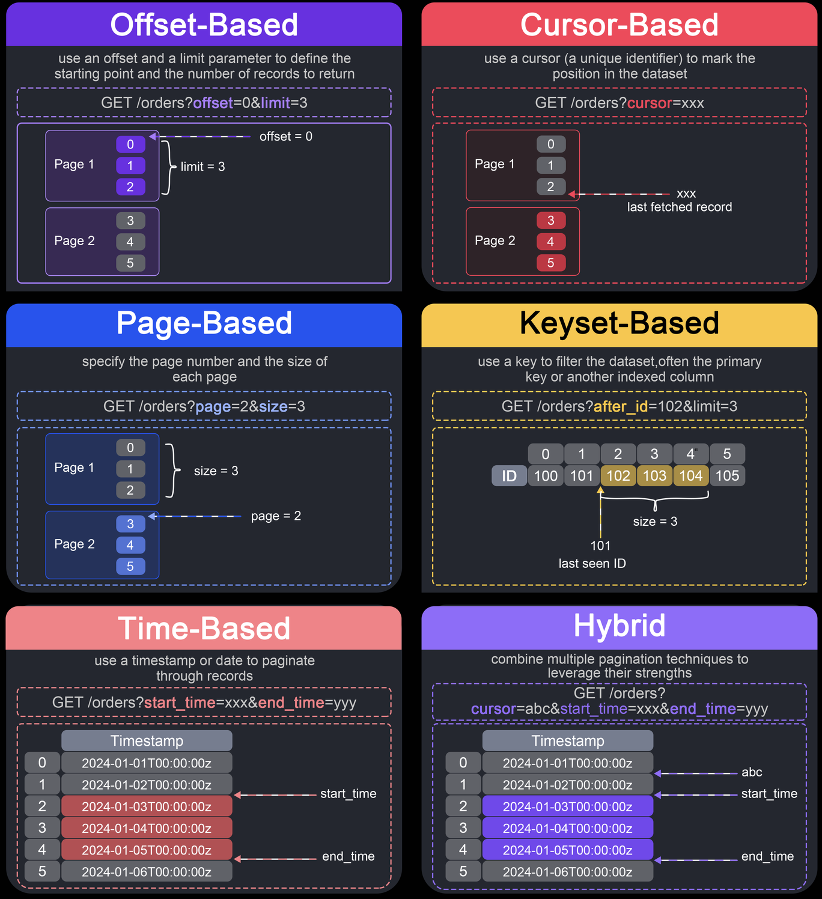

# Pagination

Pagination lets an API return a slice of a large dataset instead of the whole
collection. The six techniques below overlap: 
- **page** is usually a client-facing wrapper over **offset**
- **cursor** is an API shape that often encodes a **keyset** (or a timestamp)
- **time** is keyset on a time column
- **hybrid** mixes two of the others.





## Offset

Uses **offset** (rows to skip) and **limit** (rows to return).

```
GET /orders?offset=0&limit=3
GET /orders?offset=3&limit=3   # next window
```

Would lead to an SQL statement like
```sql
SELECT * FROM orders LIMIT 3 OFFSET 3;
```

Pros:
- Simple to implement and understand
- Easy random access that jumps to any window without going through previous pages
- Works with any sort order, including ones that are not unique

Cons:
- Deep offsets are expensive because the database still reads and discards skipped rows
- Inserts/deletes while offsetting cause skipped or duplicated rows
- Offset is not a stable identity of a record

When to use: 
- admin tables
- small catalogs
- “jump to page N” UIs 
- prototypes.


## Page

Uses a 1-based **page** number and **page size**.  Is basically a client-facing wrapper over `Offset`

```
GET /orders?page=2&pageSize=20
```

Also leads to an SQL statement like
```sql
SELECT * FROM orders LIMIT 3 OFFSET 3;
```

Pros:
- Matches numbered pagers in UIs (“page 3 of 12”)
- Total count enables progress (“showing 21–40 of 87”)
- Familiar for REST clients and admin tools

Cons:
- Same cost and drift problems as offset
- `COUNT(*)` on every list request adds latency on large tables
- Empty last pages if rows are deleted between requests
- Clients that send `page=99999` still force a large offset unless you clamp

When to use: 
- browse UIs that show page numbers and totals 


## Cursor

The client sends an **opaque token** that marks where the last response ended.
The server decodes it and continues from there. The token is not a page number, 
it usually encodes the last row’s sort key(s), or sometimes an offset.

```
GET /orders?limit=3
# response includes next_cursor=eyJpZCI6NDJ9

GET /orders?cursor=eyJpZCI6NDJ9&limit=3
```

Typical JSON envelope:

```json
{
  "data": [{ "id": 43 }, { "id": 44 }, { "id": 45 }],
  "next_cursor": "eyJpZCI6NDV9",
  "prev_cursor": "eyJpZCI6NDN9"
}
```

Pros:
- Token can hide the strategy (keyset, offset, time) and stay stable if you version the payload
- Natural fit for infinite scroll and “load more”
- Combined with keyset, next-page cost stays roughly constant

Cons:
- Cannot jump to an arbitrary page without extra work
- Clients must treat the token as opaque (leaking internal IDs in a “cursor” is a leaky abstraction)
- Bidirectional paging and filters need a well-designed token

When to use: 
- feeds
- GraphQL connections
- Public APIs that should not expose offsets


## Keyset

Also called **seek** pagination. Instead of skipping N rows, filter to rows
**after** the last seen sort key. Requires a **unique, indexed, deterministic**
order — usually `(sort_column, id)`.

```
GET /orders?after_created=2026-09-01T10:00:00Z&after_id=42&limit=3
```

```sql
SELECT * FROM orders
WHERE (created_at, id) > ('2026-09-01 10:00:00', 42)
ORDER BY created_at ASC, id ASC
LIMIT 3;
```

Pros:
- Uses the index which means cost does not grow with “how far you have scrolled”
- Stable under inserts because new rows before the cursor do not shift later pages
- Precise and cache-friendly

Cons:
- No cheap jump to a certain page
- Sort column must be indexed and unique when combined with the tie-break
- Changing sort field means a different keyset
- “Previous page” is a reversed query, not `offset - limit`

When to use: 
- large ordered lists
- activity feeds
- anything that only ever asks for “next”

## Time

Windows the result by a **time range** (`since` / `until`, or `after` a
timestamp). It is keyset (or a range scan) on a time column. Common for logs,
metrics, and “what happened today”.

```
GET /events?since=2026-09-18T00:00:00Z&until=2026-09-18T12:00:00Z&limit=100
GET /orders?created_after=2026-09-01T00:00:00Z&limit=20
```

```sql
SELECT * FROM events
WHERE occurred_at >= '2026-09-18 00:00:00'
  AND occurred_at <  '2026-09-18 12:00:00'
ORDER BY occurred_at ASC, id ASC
LIMIT 100;
```

Pros:
- Matches how operators think (“last 24 hours”, “this week”)
- Prunes old partitions / time-series tables efficiently
- Natural for polling: “give me everything after `last_seen_at`”

Cons:
- Clock skew and equal timestamps
  - many rows can share one millisecond, so you still need an `id` tie-break
- Sparse periods return empty pages; dense periods overflow `limit`
- Not a substitute for total-count page UIs
- Mutating `created_at` (or using `updated_at` for “new” items) creates holes or duplicates

When to use: 
- audit logs
- notifications
- sync-since-timestamp
- time-series APIs.

## Hybrid

Combines two techniques so each covers the other’s weakness. Typical mixes:

1. **Page + offset -**  numbered UI, SQL offset, plus `COUNT(*)`
2. **Time + cursor/keyset -** first bound the day, then walk inside it with a 
  keyset so a busy hour does not require a huge offset.
3. **Offset for the first pages, keyset for deep scrol -** cheap numbered
   pager until offset cost hurts, then switch.
4. **Cursor for items + separate count -** infinite scroll with an approximate
   or cached `totalItems`.


Pros:
- Can offer both “page 3 of N” and stable “load more”
- Time window keeps keyset scans inside a hot partition
- Lets you keep a simple API for small lists and a seek API for large ones

Cons:
- Two code paths, two sets of bugs (drift vs seek, count vs cursor)
- Clients must understand which params win
- Easy to pretend you have keyset stability while still using offset

When to use: 
- products that outgrow pure page/offset (large catalogs, feeds)
but still need totals or jump-to-page in some screens.
